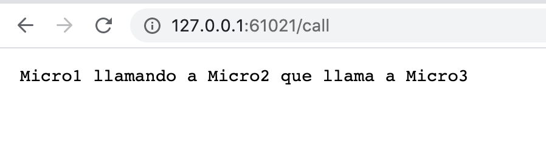
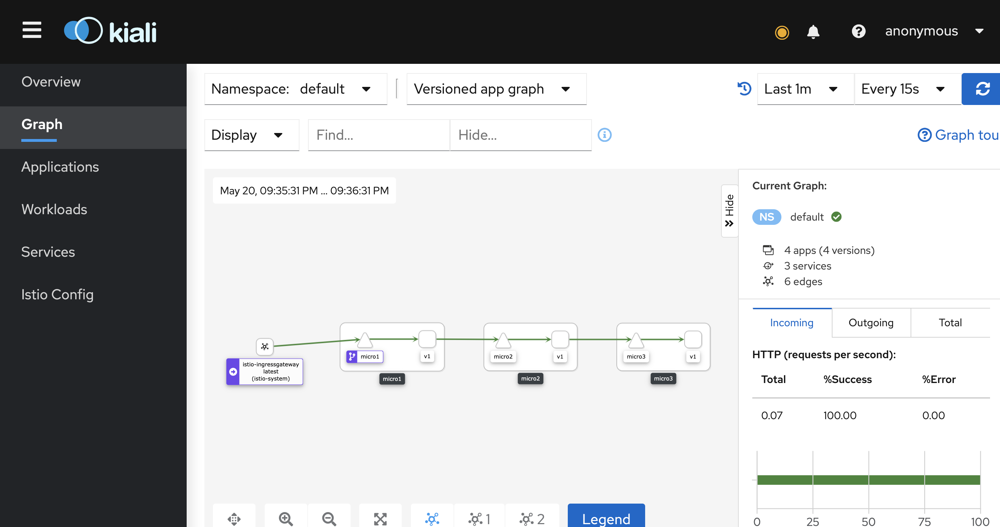

# Ejemplo de OpenTelemetry con Golang e Istio Service Mesh

1. Minikube con Profiles, para poder tener varios mini clusters de Kubernetes:

Para tener uno dedicado a Istio (ponerle el nombre que se quiera):

minikube start --memory 6144 -p istio2

Se podrán ver los perfiles (por defecto aparecerá uno default, Minikube y el nuevo) y su estado con:

minikube profile list

Para poder usar el service de kubernetes de tipo LoadBalancer:

minikube tunnel -p istio2

El dashboard de kubernetes para este profile se vera con:

minikube dashboard -p istio2

2. Instalacion de Istio:

Instalar Istio:

curl -L https://istio.io/downloadIstio | sh -

Para poder usar istioctl en la terminal (utilizar la version adecuada):

export PATH="$PATH:/Users/diegochavez/tools/istio-1.9.5/bin"

Setear el perfil demo, con varias aplicaciones instaladas:

cd istio-1.9.5/

istioctl install --set profile=demo -y

Anotar el namespace de Kubernetes para que por defecto inyecte los sidecar en las app:

kubectl label namespace default istio-injection=enabled

Para poder ver Kiali y Jaeger:

kubectl apply -f samples/addons 

kubectl rollout status deployment/kiali -n istio-system

Ver la herramienta Jaeger, para Trazabilidad:

istioctl dashboard jaeger

Ver la herramienta Kali, para observabilidad:

istioctl dashboard kiali

Ingresar con admin/admin

Se levantaran sendos browsers con estas herramientas.

3. Construir las imagenes de los Micros. En la carpeta de cada uno de ellos (micro1, micro2, micro3):

go mod init github.com/diegochavezcarro/tracing-micro1

docker build -t diegochavezcarro/tracing-micro1:v1 .

go mod init github.com/diegochavezcarro/tracing-micro2

docker build -t diegochavezcarro/tracing-micro2:v1 .

go mod init github.com/diegochavezcarro/tracing-micro3

docker build -t diegochavezcarro/tracing-micro3:v1 .

4. Instalar los micros dentro de Istio

kubectl apply -f tracing-micros.yaml

5. Instalar el Ingress Gateway:

kubectl apply -f tracing-gateway.yaml

6. Ver la app en un browser:

kubectl get svc -n istio-system

Buscar istio-ingressgateway, obtener su "IP externa" y usar el puerto interno 

Por ej:

http://10.108.89.108/call

Esto gracias a estar utilizándose el "minikube tunnel",

En caso de problemas (por ej Driver Docker)

minikube -p istio2 service istio-ingressgateway -n istio-system

Y probar en el segundo browser que se levanta (agregar "/call").

Se debera ver algo como lo siguiente:

7. En el codigo correspondiente al primer commit:

https://github.com/diegochavezcarro/tracing-micros/commit/6d4c4087a193f3453e941c8dd9914f4a73e8c7f1

No se propagaban los headers de OpenTelemetry:

response, err := http.Get("http://micro2:8081/call")

Por lo cual no habia continuidad de Trazas:

8. El el codigo final se propagan algunas de las trazas recomendadas en: 

https://istio.io/latest/docs/tasks/observability/distributed-tracing/overview/#trace-context-propagation

Ver:

https://github.com/diegochavezcarro/tracing-micros/blob/main/micro1/micro1.go

De esta manera se puede ver la trazabilidad completa:

9. En ambos casos tambien se puede ver con Kiali (incluso si no se propagaran los headers):

# Conclusion:

