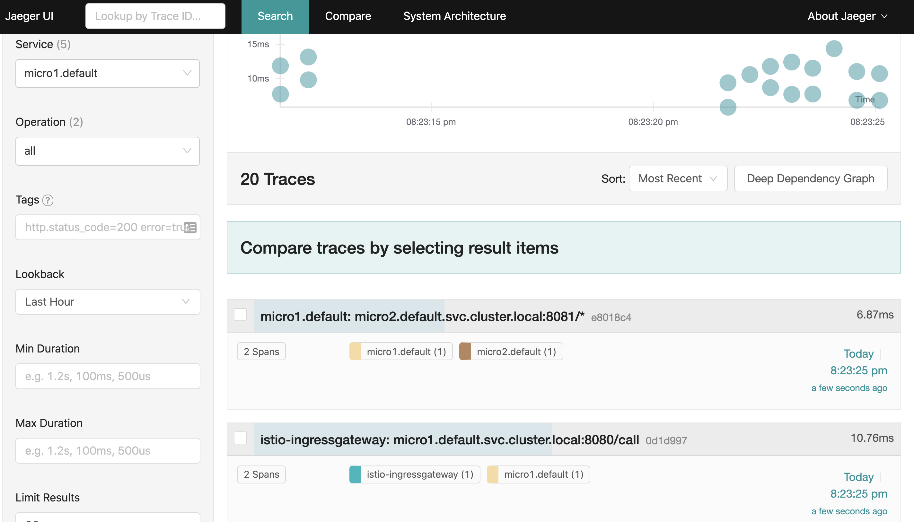
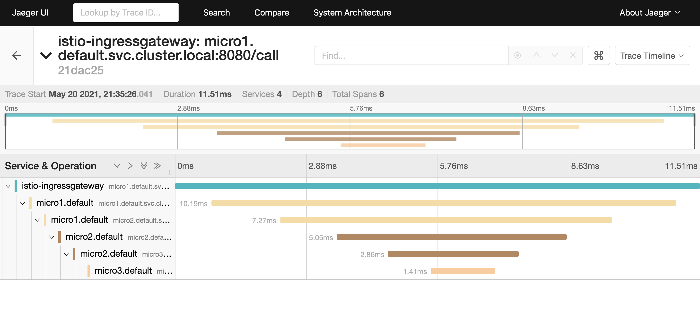

en la carpeta de cada uno de los micros:

go mod init github.com/diegochavezcarro/tracing-micro1

docker build -t diegochavezcarro/tracing-micro1:v1 .

go mod init github.com/diegochavezcarro/tracing-micro2

docker build -t diegochavezcarro/tracing-micro2:v1 .

go mod init github.com/diegochavezcarro/tracing-micro3

docker build -t diegochavezcarro/tracing-micro3:v1 .

kubectl apply -f tracing-micros.yaml

kubectl apply -f tracing-gateway.yaml

kubectl get svc -n istio-system    

